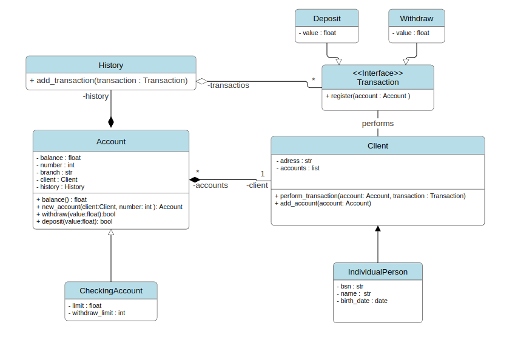

## *A project for backend enthusiasts* 😉

Beyond just another bank system implementation, this project follows a TDD approach and uses a modern Python stack for package management, validation, documentation, and other fun stuff. 😎

Modern systems need a solid structure, and modeling ideas and solutions with UML is that old but gold technique. So, let's take a look at the class diagram of the proposed system.



### Setting up the project using poetry
- Install and configure poetry in your environment. [See documentation.](https://python-poetry.org/docs/)

- After that We start a new project and created a virtual environment : 

    ``` bash
       poetry init

       poetrytes env  use 3.12.1
       
    ```

### First write the tests
    Find my article about TDD [here]().

#### Add pytest to the project:
    ``` bash
            poetry add --group dev pytest
    ```


### Here you will find :
- MVC structure 
- flake8 for code quality
- TDD - Test-Driven Development
- Testing using **pytest**
- Swagger documentation using **fastapi**
- Package control using **poetry**